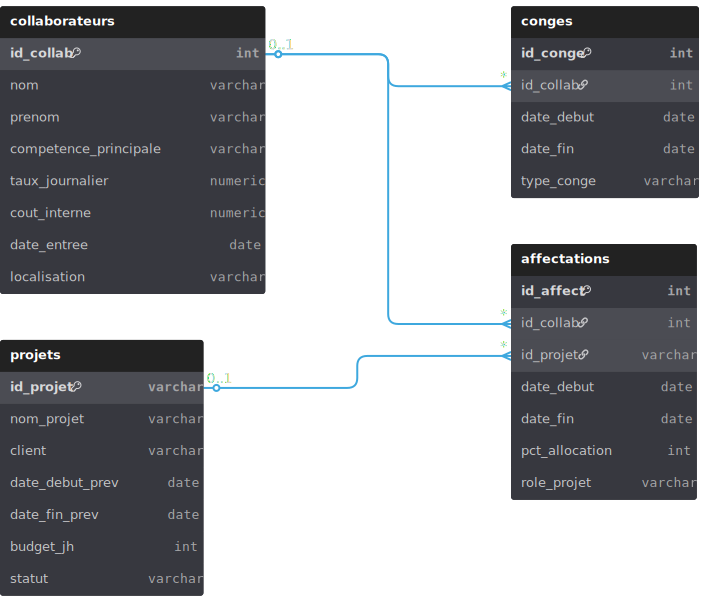

# 📊 Planification Capacitaire Projet Télécom

## 🎯 Objectif du projet

Ce projet a pour objectif d’analyser la charge des équipes projet télécom au Sénégal afin de :

- Identifier les situations de **sur-allocation (>100%)**
- Détecter les conflits entre **affectations et congés**
- Optimiser la **planification des ressources humaines**
- Améliorer la **rentabilité des projets**

👉 L’approche repose sur l’exploitation de données relationnelles via SQL pour reproduire des problématiques réelles de gestion de projet télécom.

---

## 🧠 Contexte métier

Dans les projets télécom (déploiement réseau, fibre, 4G/5G), la planification capacitaire est un enjeu critique :

- Les ressources sont limitées et hautement spécialisées  
- Les projets sont soumis à des délais stricts imposés par les opérateurs  
- Une mauvaise allocation peut entraîner des **retards critiques**  
- Les surcharges impactent la productivité et la qualité des livrables  
- Une bonne planification améliore directement la **performance financière des projets**

---

## 🗂️ Modélisation de la base de données

### 📌 Tables principales

#### 🙌 `collaborateurs`
- `id_collab` (PK)
- nom, prenom
- competence_principale
- taux_journalier
- cout_interne
- date_entree
- localisation

#### 📁 `projets`
- `id_projet` (PK)
- nom_projet
- client (Orange SN, Expresso, Yas SN)
- date_debut_prev, date_fin_prev
- budget_jh
- statut

#### 🔗 `affectations`
- `id_affect` (PK)
- `id_collab` (FK → collaborateurs)
- `id_projet` (FK → projets)
- date_debut, date_fin
- pct_allocation
- role_projet

#### 🏖️ `conges`
- `id_conge` (PK)
- `id_collab` (FK → collaborateurs)
- date_debut, date_fin
- type_conge

---

## 🔗 Relations clés

- Un **collaborateur** peut être affecté à plusieurs **projets**
- Un **projet** mobilise plusieurs **collaborateurs**
- Un **collaborateur** peut avoir plusieurs périodes de **congé**

📊 Le modèle de données intègre la gestion des **contraintes temporelles** (affectations vs congés) afin d’analyser la capacité réelle des ressources.

---

## 🛠️ Base de données et outils

- **PostgreSQL** — Stockage et modélisation des données  
- **Visual Studio Code** — Développement et exécution des scripts SQL  
- [Créer un diagramme ERD avec dbdiagram.io](https://dbdiagram.io) — Visualisation du modèle relationnel  
- **Données générées par IA** — Simulation de cas métier réalistes (sur-allocation, conflits de planning)

---

## 🔍 Analyses réalisées

Ce projet permet de répondre à plusieurs problématiques clés :

-  Calcul du **budget total des projets (en JH)**  
-  Détection des **collaborateurs sur-alloués (>100%) en avril 2026**  
-  Identification du **collaborateur le plus sollicité**  
-  Détection des **conflits entre congés et affectations**  
-  Analyse de la **charge par projet**

👉 L’ensemble des requêtes est disponible dans :  
    [planification_telecom_sn.session.sql](planification_telecom_sn.session.sql)

---

## 🚨 Cas métier simulé

Des cas de **sur-allocation (>100%)** ont été volontairement introduits en **avril 2026** afin de :

- Reproduire des erreurs de planification réelles  
- Tester la robustesse des analyses  
- Identifier les risques opérationnels  

---

## 👤 Auteur

**Data Analyst / Coordinatrice SIG**  
Projet basé sur des données simulées adaptées au contexte télécom au Sénégal

📧 Contact : [mounas286@gmail.com](mailto:mounas286@gmail.com)

---

## ⭐ Si ce projet t’intéresse

N’hésite pas à :

- ⭐ Star le repository  
- 🍴 Fork le projet  
- 💬 Partager ton feedback
  
  ---

###  🏠 Précédent : [Portfolio](https://mayskills.github.io/portfolio/)
